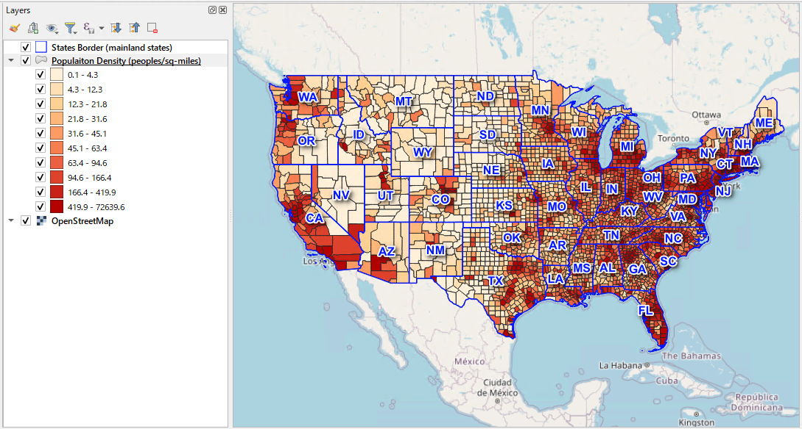
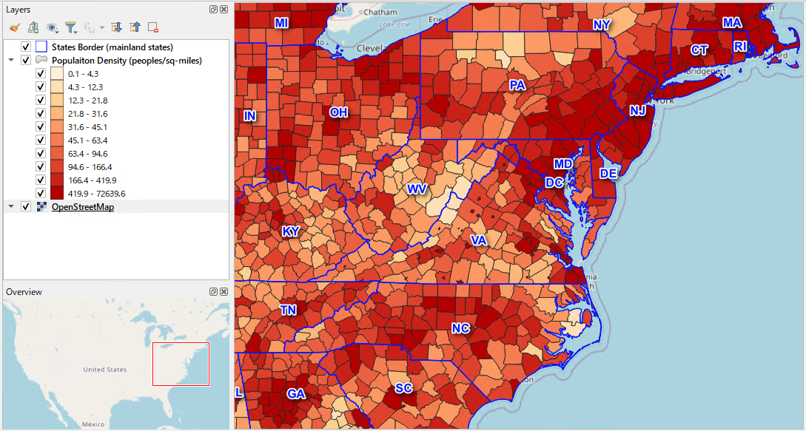
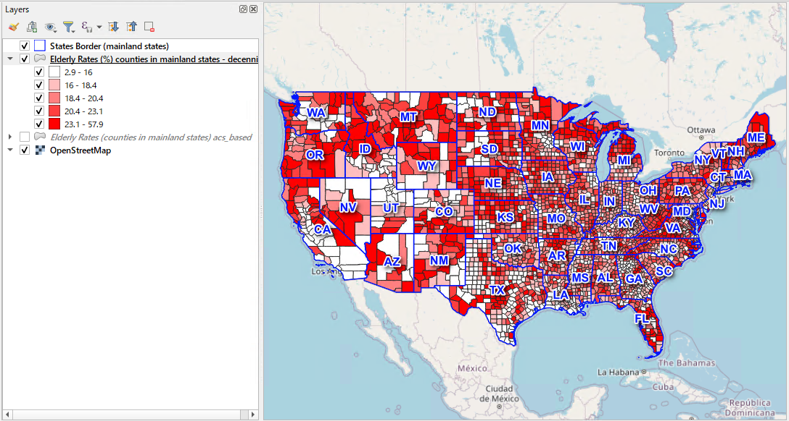
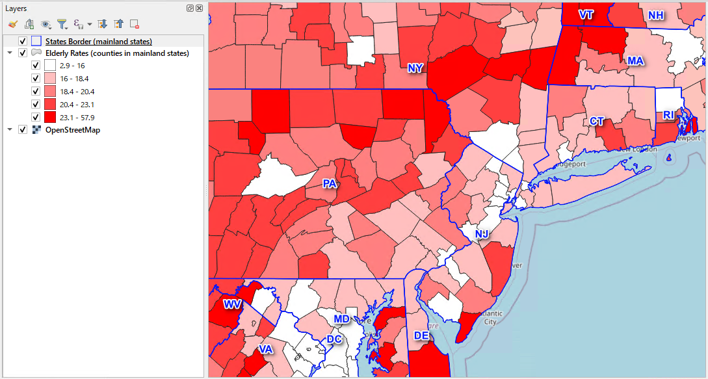
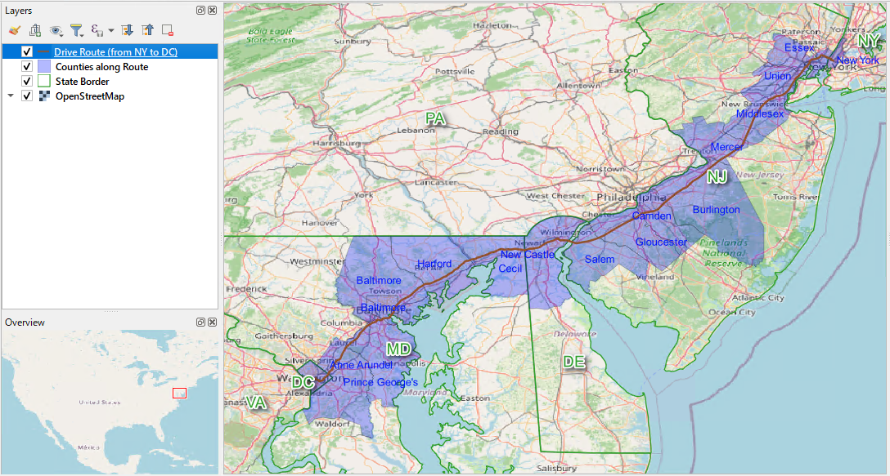

# GIS Trade Area Analysis — US

> Spatial analysis toolkit for the United States — PostGIS SQL templates and Python data pipelines for county-level location intelligence.


---

## Overview

A spatial analysis toolkit built on PostgreSQL + PostGIS and Python, focused on US county-level administrative boundary and census data. The SQL templates cover real-world business scenarios — demographic analysis, trade area sizing, and location intelligence — and can be run immediately by editing the `WITH params AS (...)` block at the top.

Census data covers **~3,221 counties** across the United States sourced from two complementary datasets:
- **ACS 5-year estimates (2022)** — annual updates, broad variable set, sample-based estimates
- **Decennial Census 2020** — full enumeration (100% count), highest accuracy, limited variables

Administrative boundary geometries are sourced from the US Census Bureau TIGER/Line program via the `pygris` library.

> **Companion repository:** [gis-trade-area-analysis](https://github.com/TomoImai-GIS/gis-trade-area-analysis) — equivalent toolkit for Japan, covering 1,917 municipalities with e-Stat census data.

---

## Sample Output


*Population density by county (48 contiguous states, persons/sq mi) — generated with [`sql/03_visualization/03-02_population_density_county.sql`](sql/03_visualization/03-02_population_density_county.sql) + QGIS. ACS 5-year 2022. Land area sourced from TIGER/Line `aland` field for accurate density calculation.*


*Zoomed view — East Coast (Mid-Atlantic to New England). The density gradient from Manhattan outward to suburban and rural counties is clearly visible.*

**Notable patterns:**

| Pattern | Explanation |
|---------|-------------|
| Extreme concentration in Northeast corridor | New York County (Manhattan) tops ~27,000 persons/km²; density drops sharply westward from the Boston–Washington corridor |
| Very low density across the interior West | Wyoming, Montana, and Nevada counties often fall below 1 person/km² — frontier-county territory |

---

## Use Cases

### 👴 Demographic & Aging Analysis

Map and rank counties by elderly population rate — useful for **healthcare facility planning**, **senior services market research**, and **retirement community site selection**.

The query supports ACS 5-year estimates (more recent) and Decennial Census (more accurate for small counties) with a single parameter switch:

```sql
-- sql/03_visualization/03-01_elderly_rate_county.sql
WITH params AS (
    SELECT
        'acs'        AS data_source,   -- 'acs' or 'decennial'
        2022         AS acs_year,
        2020         AS dec_year,
        'contiguous' AS area_filter    -- 'all' / 'contiguous' / 'FL' / 'NY' / ...
)
```


*Elderly rate by county (48 contiguous states) — generated with [`sql/03_visualization/03-01_elderly_rate_county.sql`](sql/03_visualization/03-01_elderly_rate_county.sql) + QGIS. ACS 5-year 2022. Data source switchable to Decennial Census 2020 via a single parameter.*


*Zoomed view — East Coast (Mid-Atlantic to New England). State boundaries overlaid from `admin_us.states`.*

**Notable patterns:**

| Pattern | Explanation |
|---------|-------------|
| Very low elderly rate (~3–10%) | Military base counties (Fort Benning GA, Camp Lejeune NC, Fort Riley KS), college towns (BYU Provo UT, Texas A&M TX), Native American reservation counties (Pine Ridge SD), oil-boom counties (McKenzie ND — Bakken shale) |
| Extremely high elderly rate (57.9%) | Sumter County FL — home of **The Villages**, the largest planned retirement community in the US (~130,000+ residents, 55+ only) |
| New England gap in Decennial layer | Connecticut appears blank when using Decennial Census due to a 2022 county reorganisation (8 legacy counties → 9 Planning Regions). Handled via a vintage-aware geometry CTE; see [Known Issues](docs/census_us_README.md#6-known-issues). |

### 🏪 Trade Area Analysis *(planned)*

Aggregate county-level population, elderly rate, household income, and poverty data within a defined trade area. The starting point for **retail site selection** and **franchise territory planning**.

### 🗺️ Route Analysis

Identify which counties a GPS-logged route passes through, in travel order, with kilometres driven per county and ACS population data. Useful for **delivery route planning**, **logistics territory design**, and **field sales territory management**.

```sql
-- sql/02_analysis/02-05_list_counties_along_route_from_gps_log.sql
WITH params AS (
    SELECT
        384  AS target_record_id,  -- record_id from the gps_log table
        2022 AS survey_year        -- ACS vintage year
)
```

Example: Empire State Building (NYC) → US Capitol (DC).
Output lists NY → NJ → DE → MD → DC counties sorted by distance from route start.


*Counties along route: Empire State Building, NYC → US Capitol, Washington DC via I-95 / MD-295. Counties highlighted in travel order with ACS population data — generated with [`sql/02_analysis/02-05_list_counties_along_route_from_gps_log.sql`](sql/02_analysis/02-05_list_counties_along_route_from_gps_log.sql) + QGIS.*

---

## SQL Templates

→ **[Full template index](sql/README.md)**

| Category | File | Purpose |
|----------|------|---------|
| [`sql/01_basic/`](sql/01_basic/) | [01-01_find_county_from_point.sql](sql/01_basic/01-01_find_county_from_point.sql) | Reverse-geocode a coordinate to county — name, GEOID, state, area_km2 |
| [`sql/01_basic/`](sql/01_basic/) | [01-02_lookup_county_by_geoid.sql](sql/01_basic/01-02_lookup_county_by_geoid.sql) | County profile from a GEOID — area, population, density, state share |
| `sql/01_basic/` | *(01-03 planned)* | Distance calculation between two points |
| `sql/02_analysis/` | *(planned)* | Trade area population, demographic ranking, income/poverty analysis |
| [`sql/02_analysis/`](sql/02_analysis/) | [02-05_list_counties_along_route_from_gps_log.sql](sql/02_analysis/02-05_list_counties_along_route_from_gps_log.sql) | List counties along a GPS-logged route in travel order — route length per county and ACS demographics |
| [`sql/03_visualization/`](sql/03_visualization/) | [03-01_elderly_rate_county.sql](sql/03_visualization/03-01_elderly_rate_county.sql) | County polygons with elderly rate for QGIS choropleth — ACS or Decennial, parameterised coverage |
| [`sql/03_visualization/`](sql/03_visualization/) | [03-02_population_density_county.sql](sql/03_visualization/03-02_population_density_county.sql) | County polygons with population density (persons/km² and persons/sq mi) — uses TIGER/Line `aland` for accurate land area |

---

## Python Data Pipelines

Python scripts for importing US Census Bureau data into PostgreSQL. All scripts use a `WITH params AS (...)` style parameters section at the top and require a `my_access.py` credentials module.

| Script | Purpose | Output table |
|--------|---------|--------------|
| [`05-01_import_tiger_boundaries.py`](python/05_data_import/05-01_import_tiger_boundaries.py) | Download TIGER/Line shapefiles via `pygris`; reproject to WGS84 | `admin_us.states`, `admin_us.counties` |
| [`05-02_import_acs_demographics.py`](python/05_data_import/05-02_import_acs_demographics.py) | Fetch ACS 5-year estimates from Census API (49 age variables + income + poverty) | `census_us.acs_demographics` |
| [`05-03_import_decennial_census.py`](python/05_data_import/05-03_import_decennial_census.py) | Fetch 2020 Decennial Census DHC via direct HTTP request (49 age variables) | `census_us.decennial_census` |

---

## Quick Start

### Prerequisites

- PostgreSQL 12+ with PostGIS 3.0+
- TIGER/Line boundaries loaded into `admin_us` schema
- Census data loaded into `census_us` schema

See [Data Sources](#data-sources) below. For full schema design and step-by-step ingestion instructions, see [`docs/census_us_README.md`](docs/census_us_README.md).

### 1. Enable PostGIS

```sql
CREATE EXTENSION IF NOT EXISTS postgis;
```

### 2. Import boundary and census data

```bash
# Edit sys.path and credentials in each script before running
python python/05_data_import/05-01_import_tiger_boundaries.py
python python/05_data_import/05-02_import_acs_demographics.py
python python/05_data_import/05-03_import_decennial_census.py
```

### 3. Run your first query

Open `sql/03_visualization/03-01_elderly_rate_county.sql` in QGIS DB Manager, set geometry column to `geom` (SRID 4326), and load as a PostGIS layer.

---

## Data Sources

| Dataset | Provider | Access | Notes |
|---------|----------|--------|-------|
| TIGER/Line boundary files | [US Census Bureau, Geography Division](https://www.census.gov/geographies/mapping-files/time-series/geo/tiger-line-file.html) | `pygris` library (no API key) | States + Counties, 2020 & 2022 vintages, WGS84 |
| ACS 5-year estimates | [US Census Bureau, American Community Survey](https://www.census.gov/programs-surveys/acs) | Census API (free key required) | 2022 vintage; B01001, B01002, B19013, B17001 tables |
| Decennial Census 2020 DHC | [US Census Bureau, 2020 Census](https://www.census.gov/programs-surveys/decennial-census/decade/2020/2020-census-main.html) | Census API (free key required) | P12 Sex by Age (49 variables) |

Census API key registration: https://api.census.gov/data/key_signup.html

> For full data source documentation, schema design, variable mappings, and known issues (including the Connecticut county reorganisation), see [`docs/census_us_README.md`](docs/census_us_README.md).

---

## Repository Layout

```
gis-trade-area-analysis-us/
├── sql/                          # SQL templates
│   ├── README.md                 # Full template index with code examples
│   ├── 01_basic/                 # Foundational spatial operations
│   │   ├── 01-01_find_county_from_point.sql
│   │   └── 01-02_lookup_county_by_geoid.sql
│   ├── 02_analysis/              # Core spatial analysis (partial)
│   └── 03_visualization/         # QGIS / map output queries
│       ├── 03-01_elderly_rate_county.sql
│       └── 03-02_population_density_county.sql
├── python/
│   └── 05_data_import/           # Census data ingestion scripts
│       ├── 05-01_import_tiger_boundaries.py
│       ├── 05-02_import_acs_demographics.py
│       └── 05-03_import_decennial_census.py
├── output/
│   ├── sql/                      # Map output from SQL + QGIS workflows
│   └── python/                   # Chart output from Python scripts
└── docs/
    ├── README.md                 # Documentation index
    └── census_us_README.md       # Census data schema & ingestion design
```

---

## Attribution

Data used in this repository is sourced from:

- **US Census Bureau** — TIGER/Line shapefiles, ACS 5-year estimates, and Decennial Census data. Free for public use. [Terms of use](https://www.census.gov/about/policies/open-gov/open-data.html)
- **OpenStreetMap contributors** — Basemap tiles used in QGIS visualisations. © OpenStreetMap contributors, ODbL. [Terms](https://www.openstreetmap.org/copyright)
